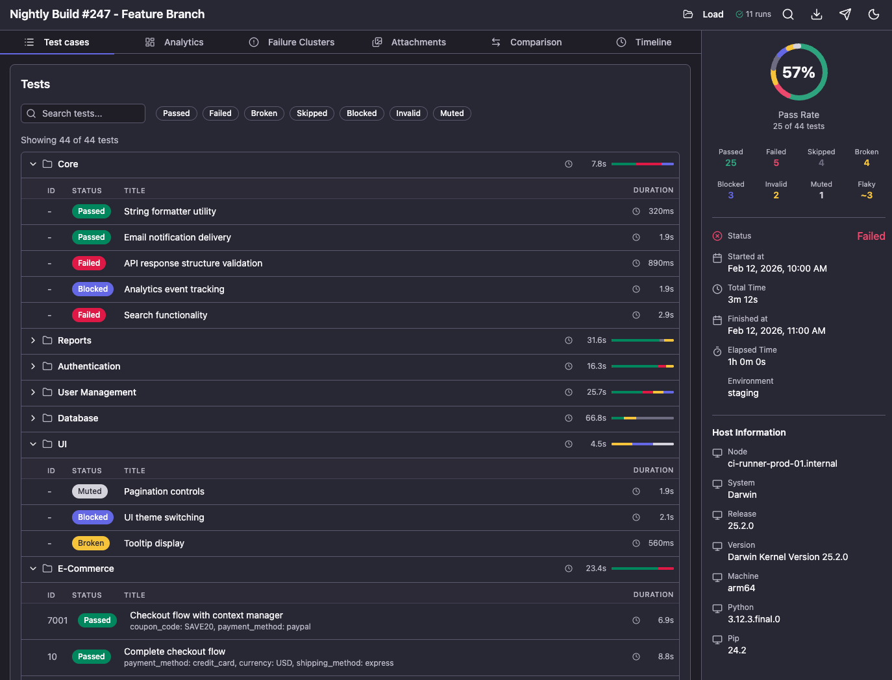

# Qase Report

Open-source CLI tool for visualizing test reports in [Qase Report Format](https://github.com/qase-tms/specs/tree/master/report). Interactive HTML report with dashboard, test list, step timeline, attachments viewer, and history analytics.



## Features

- **Dashboard** — Pass/fail statistics, completion rate ring, run metadata
- **Test List** — Filterable test cases with suite hierarchy and expandable rows
- **Step Timeline** — Nested steps with duration visualization
- **Attachments** — Screenshots, logs, and files with lightbox viewer
- **History Analytics** — Trends, flakiness detection, regression alerts, stability scoring
- **Command Palette** — Quick search with ⌘K / Ctrl+K
- **Dark Theme** — Dark mode by default with light theme option
- **Static Export** — Generate standalone HTML file that works offline

## Installation (Development)

### Requirements

- Node.js >= 18.0.0
- npm

### Setup

```bash
# Clone the repository
git clone https://github.com/qase-tms/qase-report.git
cd qase-report

# Install dependencies
npm install

# Build the CLI
npm run build
```

After building, you can run the CLI directly:

```bash
node dist/cli/index.js --help
```

Or link it globally for easier access:

```bash
npm link
qase-report --help
```

## Usage

### Open Report in Browser

Start a local server and open the report in your browser:

```bash
qase-report open ./path/to/results
```

Options:

| Option | Description | Default |
|--------|-------------|---------|
| `-p, --port <number>` | Port number | `3000` |
| `--no-open` | Don't open browser automatically | — |
| `-H, --history <path>` | History file path | `./qase-report-history.json` in results folder |

Examples:

```bash
# Open report on custom port
qase-report open ./results -p 8080

# Open without launching browser
qase-report open ./results --no-open

# Specify custom history file
qase-report open ./results -H ./my-history.json
```

The `open` command automatically saves run data to the history file, enabling trend analysis and flakiness detection across multiple runs.

### Generate Static HTML

Create a standalone HTML file that can be opened directly in a browser (works with `file://` protocol):

```bash
qase-report generate ./path/to/results
```

Options:

| Option | Description | Default |
|--------|-------------|---------|
| `-o, --output <file>` | Output file path | `report.html` |
| `-H, --history <path>` | History file to embed | — |

Examples:

```bash
# Generate report with custom name
qase-report generate ./results -o my-report.html

# Generate with embedded history
qase-report generate ./results -H ./history.json -o report-with-history.html
```

## Data Format

Qase Report expects data in the [Qase Report Format](https://github.com/qase-tms/qase-report-format) structure:

```
results/
├── run.json              # Run metadata and statistics
├── results/
│   ├── {uuid}.json       # Individual test results
│   └── ...
├── attachments/          # Screenshots, logs, files
│   └── ...
└── qase-report-history.json  # Optional: history for analytics
```

### run.json

Contains run metadata, execution timing, and test summary:

```json
{
  "title": "Test Run",
  "environment": "production",
  "execution": {
    "start_time": 1707700000000,
    "end_time": 1707700060000,
    "duration": 60000,
    "cumulative_duration": 45000
  },
  "stats": {
    "total": 100,
    "passed": 95,
    "failed": 3,
    "skipped": 2
  },
  "results": [
    { "id": "uuid-1", "title": "Test 1", "status": "passed", "duration": 150, "thread": "worker-1" }
  ],
  "threads": ["worker-1", "worker-2"],
  "suites": ["Auth", "API"],
  "host_data": {
    "node": "v20.0.0",
    "system": "Darwin",
    "release": "23.0.0",
    "version": "Darwin Kernel Version 23.0.0",
    "machine": "arm64"
  }
}
```

### results/{uuid}.json

Individual test result with steps, attachments, and metadata:

```json
{
  "id": "uuid-1",
  "title": "User can login with valid credentials",
  "signature": "auth.login.valid_credentials",
  "muted": false,
  "execution": {
    "status": "passed",
    "start_time": 1707700000000,
    "end_time": 1707700000150,
    "duration": 150,
    "stacktrace": null,
    "thread": "worker-1"
  },
  "message": null,
  "relations": {
    "suite": {
      "data": [
        { "title": "Auth", "public_id": null },
        { "title": "Login", "public_id": null }
      ]
    }
  },
  "steps": [
    {
      "name": "Navigate to login page",
      "status": "passed",
      "duration": 50,
      "steps": []
    }
  ],
  "attachments": [
    {
      "name": "screenshot.png",
      "mime_type": "image/png",
      "file_path": "attachments/screenshot.png"
    }
  ],
  "params": {},
  "param_groups": [],
  "fields": {},
  "testops_ids": [123]
}
```

### Test Status Values

| Status | Description |
|--------|-------------|
| `passed` | Test completed successfully |
| `failed` | Test failed with assertion errors |
| `skipped` | Test was skipped |
| `broken` | Test encountered unexpected errors preventing execution |
| `blocked` | Test was blocked by external dependency |
| `invalid` | Test configuration or data is invalid |
| `muted` | Test failures are muted/ignored |

### qase-report-history.json

History file for tracking test results across multiple runs. Enables trend analysis, flakiness detection, and stability scoring.

```json
{
  "schema_version": "1.0.0",
  "runs": [
    {
      "run_id": "1707700000000",
      "title": "Test Run",
      "environment": "production",
      "start_time": 1707700000000,
      "end_time": 1707700060000,
      "duration": 60000,
      "stats": {
        "total": 100,
        "passed": 95,
        "failed": 3,
        "skipped": 2
      }
    }
  ],
  "tests": [
    {
      "signature": "auth.login.valid_credentials",
      "title": "User can login with valid credentials",
      "runs": [
        {
          "run_id": "1707700000000",
          "status": "passed",
          "duration": 150,
          "start_time": 1707700000000,
          "error_message": null
        }
      ]
    }
  ]
}
```

**Key fields:**

- `schema_version` — Format version for future migrations
- `runs` — Array of run summaries with stats
- `tests` — Array of per-test history grouped by `signature`
- `signature` — Stable test identifier (not UUID) for tracking across runs
- `error_message` — First line of error, used for flakiness detection

## Tech Stack

- React 18 + TypeScript 5.9
- Vite 5
- shadcn/ui + Tailwind CSS v4
- MobX for state management
- TanStack Table + Virtual for performant tables
- Recharts for visualizations
- Zod v4 for schema validation

## License

MIT
